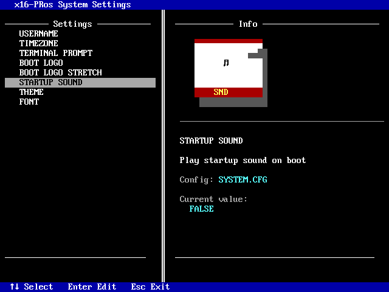

<div align="center">


<h1>x16-PRos Operating System</h1>

[](LICENSE.TXT)
[](docs/changes/v0.9.txt)
[](https://nasm.us/)
[](#running-x16-pros)

[](https://github.com/PRoX2011/x16-PRos/stargazers)
[](https://github.com/PRoX2011/x16-PRos/commits)
[](CONTRIBUTING.md)


**A minimalistic 16-bit operating system written in NASM for x86 architecture**

[Website](https://x16-pros.prosdev.org/) • [API Documentation](docs/API.md) • [Configs Documentation](docs/CONFIGURATION.md)


---

</div>


## Overview

**x16-PRos** is a lightweight real-mode operating system designed for the x86 architecture and written entirely in NASM assembly. It features a command-line interface, supports the FAT12 file system, and includes a large standard software suite. This OS demonstrates fundamental operating system design principles, including booting, file system management, interrupt handling, and hardware interaction.

Designed for simplicity and educational value, x16-PRos provides a platform for low-level programming enthusiasts to explore bare-metal development on x86 systems.

> [!IMPORTANT]
> The project needs contributors. Now only I, PRoX2011, is working on the kernel, but I can’t do everything alone. I would like to ask you how to help the project.
> - Programs
> - Development of a compatibility layer with MS DOS
> - Improved documentation and instructions
>
> If you help - thank you so much

<div style="display: flex; flex-direction: row; gap: 20px">
  
  
</div>
<br>
<div style="display: flex; flex-direction: row; gap: 20px">
  
  
</div>

---

[](https://starchart.cc/PRoX2011/x16-PRos)

---

Developing this project requires a lot of time and effort. The project is completely open source. Everything is being done out of pure passion, so if you like it, I'd like to ask you to support me (PRoX2011) financially using this link: [support me](https://dalink.to/proxdev)

Thanks to everyone who supported me financially. All your nicknames will appear in the project's sponsors list.

---

## Key Features

- **MS-DOS Compatibility**: Native support for running standard MS-DOS `.COM` and `.EXE` executables.
- **Encrypted Password System**: XOR-based password encryption with custom key
- **User Authentication**: Login system with configurable user account
- **Password Protection**: Encrypted PASSWORD.CFG prevents plaintext password storage
- **Customizable Prompts**: User-defined command prompt via PROMPT.CFG
- **Username Support**: Personalized user sessions stored in USER.CFG
- **Color Themes**: Multiple color palettes (DEFAULT, GROOVYBOX, UBUNTU) and fully customizable THEME.CFG if 3 standard themes are not enough for you
- **First-Boot Setup**: Automated SETUP.BIN execution on initial startup
- **Auto-Execution**: AUTOEXEC.BIN support for startup scripts
- **Mouse Driver**: Full PS/2 and USB mouse support
- **Directory Support**: Create, delete, and navigate directories (MKDIR, DELDIR, CD)
- **File Management**: Complete CRUD operations on files
- **File Operations**: COPY, REN, DEL, TOUCH, WRITE commands
- **File Inspection**: CAT, SIZE, HEAD, TAIL, GREP utilities
- **BMP Image Viewer**: 256-color BMP rendering with 2x upscaling support
- **Parameter Passing**: Command-line argument support for applications
- **API Access**: Comprehensive kernel API for file, disk, time and output operations
- **Debugging Tools**: CPU info display, memory viewer, register inspection
- **Multiple disk support**: detect/list available drives and switch drives in the terminal
- **cp866 fonts support**: change system font using config or TUI application
- **Timezones support**: change your time zone via TIMEZONE.CFG
- **AND MUCH MORE FEATURES**

---


## 🖥️ PRos Terminal

The system includes a powerful terminal - **PRos Terminal**. It not only allows you to launch programs but also offers a wide range of built-in commands and utilities.

> [!NOTE]
> To run a program, enter the name of the executable file (.BIN or .COM) with or without an extension. Programs will be launched from any directory if its file is placed in the BIN/ directory, and if the program file is not found there, the system will try to find the program in the current, working directory

<div style="display: flex; flex-direction: row; gap: 20px">
  
  
</div>
<br>
<div style="display: flex; flex-direction: row; gap: 20px">
  
  
</div>

#### Basic Commands
| Command | Description |
|---------|-------------|
| `help` | Display categorized command reference with navigation |
| `info` | Show system information and OS details |
| `cls` | Clear terminal screen |
| `ver` | Display PRos terminal version |
| `exit` | Exit to bootloader |

#### System Information
| Command | Description |
|---------|-------------|
| `cpu` | Display detailed CPU information (family, model, cores, cache) |
| `date` | Show current date (DD/MM/YY format) |
| `time` | Show current time (HH:MM:SS format, UTC) |

#### File Operations
| Command | Syntax | Description |
|---------|--------|-------------|
| `dir` | `dir` | List files in current directory with size info |
| `cat` | `cat <filename>` | Display file contents |
| `size` | `size <filename>` | Show file size in bytes |
| `del` | `del <filename>` | Delete a file (kernel.bin protected) |
| `copy` | `copy <source> <dest>` | Copy file (root directory only) |
| `ren` | `ren <old> <new>` | Rename file (root directory only) |
| `touch` | `touch <filename>` | Create empty file |
| `write` | `write <file> <text>` | Write text to file |

#### Directory Operations
| Command | Syntax | Description |
|---------|--------|-------------|
| `cd` | `cd <dirname>` | Change directory (use `..` for parent, `/` for root) |
| `mkdir` | `mkdir <dirname>` | Create new directory |
| `deldir` | `deldir <dirname>` | Delete empty directory |

#### Media & Display
| Command | Syntax | Description |
|---------|--------|-------------|
| `view` | `view <file> [-upscale] [-stretch]` | Display BMP image with optional 2x scaling |

#### Power Management
| Command | Description |
|---------|-------------|
| `shut` | Shutdown system via APM |
| `reboot` | Restart system |


---

## 📦 Standard Software Package

x16-PRos includes a comprehensive collection of built-in applications:

<table>
<tr>
  <td width="33%" align="center">
    <br>
    <b>WRITER.BIN</b><br>
    Simple editor for text files
  </td>
  <td width="33%" align="center">
    <br>
    <b>HEXEDIT.BIN</b><br>
    Hex editor
  </td>
  <td width="33%" align="center">
    <br>
    <b>LAUNCH.BIN</b><br>
    TUI program launcher
  </td>
</tr>
<tr>
  <td width="33%" align="center">
    <br>
    <b>MINE.BIN</b><br>
    Minesweeper game
  </td>
  <td width="33%" align="center">
    <br>
    <b>PIANO.BIN</b><br>
    Simple piano to play melodies using PC Speaker
  </td>
  <td width="33%" align="center">
    <br>
    <b>BCHART.BIN</b><br>
    Barchart software for creating simple diagrams
  </td>
</tr>
<tr>
  <td width="33%" align="center">
    <br>
    <b>SPACE.BIN</b><br>
    Space arcade game
  </td>
  <td width="33%" align="center">
    <br>
    <b>CALC.BIN</b><br>
    Simple calculator
  </td>
  <td width="33%" align="center">
    <br>
    <b>MEMORY.BIN</b><br>
    Memory viewer
  </td>
</tr>
<tr>
  <td width="33%" align="center">
    <br>
    <b>PAINT.BIN</b><br>
    Paint program
  </td>
  <td width="33%" align="center">
    <br>
    <b>PONG.BIN</b><br>
    Pong game
  </td>
  <td width="33%" align="center">
    <br>
    <b>FETCH.BIN</b><br>
    Print system fetch (I use PRos btw)
  </td>
</tr>
<tr>
  <td width="33%" align="center">
    <br>
    <b>IMFPLAY.BIN</b><br>
    IMF music player
  </td>
  <td width="33%" align="center">
    <br>
    <b>CLOCK.BIN</b><br>
    Clock application
  </td>
  <td width="33%" align="center">
    <br>
    <b>PROCENTC.BIN</b><br>
    Percentages calculator
  </td>
</tr>
<tr>
  <td width="33%" align="center">
    <br>
    <b>TETRIS.BIN</b><br>
    Tetris game
  </td>
  <td width="33%" align="center">
    <br>
    <b>MANDEL.BIN</b><br>
    Mandelbrot-Menge
  </td>
    <td width="33%" align="center">
    <br>
    <b>BRAINF.BIN</b><br>
    Brainfuck interpreter
  </td>
</tr>
<tr>
  </td>
    <td width="33%" align="center">
    <br>
    <b>SETTINGS.BIN</b><br>
    x16-PRos system settings
  </td>
<td width="33%" align="center">
    <br>
    <b>And more...</b><br>
    SNAKE.BIN, CREDITS.BIN, AUTOEXEC.BIN, GREP.BIN, HEAD, TAIL, THEME.BIN, CHARS.BIN, WAVPLAY.BIN, FDISK.BIN, ED.BIN, HELLO.COM, FRACTAL.COM, CALENDAR.BIN
  </td>
</tr>
</table>

**Developing Your Own Programs**

You can create custom programs using NASM and the PRos API.

---


## 🛠️ Building from Source

### Packages required for compilation

- NASM
- mtools
- dosfstools
- cdrtools (optional for OS ISO image)

---

#### Installing packages:

##### Ubuntu/Debian
```
sudo apt install nasm mtools dosfstools genisoimage
```

> [!NOTE]
> cdrtools (including the original mkisofs) is not included in the official Debian/Ubuntu repositories due to licensing issues. Genisoimage (a fork that provides compatibility with mkisofs via symlink) is used instead.

##### Arch Linux / Manjaro
```
sudo pacman -Syu nasm mtools dosfstools cdrtools
```

> [!NOTE]
> Arch has a native cdrtools package available, which provides mkisofs.

##### Fedora / CentOS
```
sudo dnf install nasm mtools dosfstools genisoimage
```

---

### Compilation Steps

1. **Clone the repository:**
```bash
git clone https://github.com/PRoX2011/x16-PRos.git
cd x16-PRos
```

2. **Make build script executable:**
```bash
chmod +x build-linux.sh
```

3. **Build the project:**
```bash
./build-linux.sh
```

> [!NOTE]
> FOR ADVANSED USERS
> build-linux have special flags:
> ```
> -quiet            - disable all script messages, but not disable nasm's warnings and errors
> -no-music         - do not add music files in system build
> -no-txt           - do not add text files in system build
> -no-boot-recomp   - do not compiling bootloader, in system build using old compiled bootloader from bin/ directory
> -no-kernel-recomp - do not compiling kernel, in system build using old compiled kernel from bin/ directory
> -dtm              - disable setup on first boot. dev testing mode.
> ```

### Build Output

- `disk_img/x16pros.img` - Bootable floppy disk image (1.44MB)
- `build/` - Compiled binaries and intermediate files

---


## 🚀 Running x16-PRos

### QEMU (Recommended)

#### Install QEMU:

##### Debian/Ubuntu
```bash
sudo apt install qemu-system-x86
```

##### ArchLinux/Manjaro
```bash
sudo pacman -S qemu-system-x86
```

##### Fedora
```bash
sudo dnf install qemu-system-x86
```

#### Run with QEMU

##### Run using a command:
```bash
qemu-system-x86_64 \
    -display gtk \
    -fda disk_img/x16pros.img \
    -machine pcspk-audiodev=snd0 \
    -device adlib,audiodev=snd0 \
    -audiodev pa,id=snd0
```

##### Run using a script (recommended):
```bash
chmod +x run-linux.sh
./run-linux.sh
```

### Online Emulation

Try x16-PRos in your browser using [v86 emulator](https://copy.sh/v86/):
1. Upload `x16pros.img` as floppy or hard disk
2. Boot the system

### Real Hardware

1. Write image to USB drive:
```bash
sudo dd if=disk_img/x16pros.img of=/dev/sdX bs=512
```

2. Boot from USB drive (BIOS mode)

**UEFI Systems**: Enable "CSM Support" or "Legacy Boot" in BIOS settings

> [!NOTE]
> More detailed launch instructions are available on the project website: <https://x16-pros.prosdev.org/>

---


## Contributors

[](https://github.com/desvor58)
[](https://github.com/akbe2020)
[](https://github.com/ilnarildarovuch2)
[](https://github.com/dexoron)
[](https://github.com/realtomokokuroki)
[](https://github.com/leonardo-ono)


We welcome contributions! Special thanks to all who have submitted:
- Bug reports and fixes
- Documentation improvements
- Feature suggestions
- Program development

---


## 🤝 Contributing

### How to Contribute

1. **Report Bugs**: Open an issue on [GitHub Issues](https://github.com/PRoX2011/x16-PRos/issues)
2. **Submit Code**: Fork, develop, and create pull requests
3. **Write Programs**: Develop applications using the [PRos API](docs/API.md)
4. **Improve Docs**: Email suggestions to prox.dev.code@gmail.com

**More about contributing:** [contributing guide](CONTRIBUTING.md)

> [!IMPORTANT]
> Please use English when commenting on code and describing changes. This project is designed to be multinational and accessible to everyone.

### Development Guidelines

- Follow existing code style (NASM assembly conventions)
- Test changes in QEMU before submitting
- Document new features in comments
- Update README.md for user-facing changes

---

<div align="center">

**Made with ❤️ by PRoX**

</div>